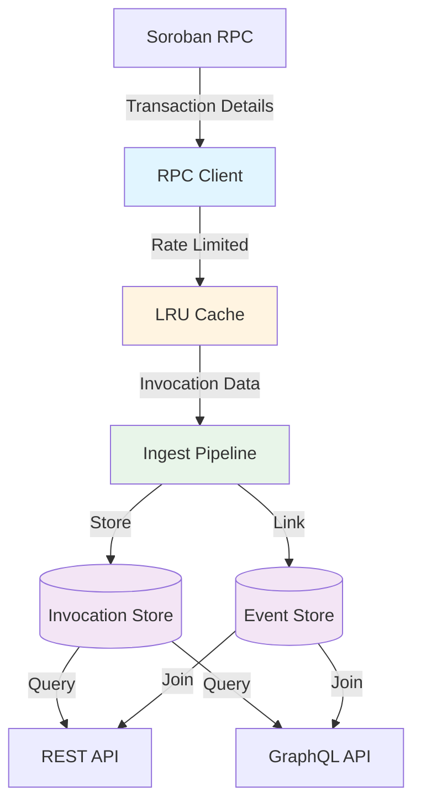

# Design Document: Contract Invocation Tracking

## Overview

This feature extends SoroScan's event indexing capabilities by tracking contract invocations that generate events. Currently, SoroScan indexes events emitted by Soroban smart contracts but lacks visibility into the invocations that triggered those events. This design adds a ContractInvocation model, integrates invocation fetching into the existing ingest pipeline, and exposes invocation data through REST and GraphQL APIs.

The system will:
- Extract invocation metadata (caller, contract, function name, parameters, result) from Soroban RPC transaction responses
- Store invocations in a new ContractInvocation table with appropriate indexes
- Link ContractEvent records to their originating invocations via foreign key
- Fetch invocations automatically during event processing with caching and rate limiting
- Expose invocation data through paginated REST endpoints and GraphQL queries with nested event resolution

This enables developers to trace event origins, understand call chains, and perform root-cause analysis during debugging.

## Architecture

### System Components



### Component Responsibilities

**RPC Client** (`stellar_client.py`)
- Fetches transaction details from Soroban RPC
- Parses transaction responses to extract invocation metadata
- Implements rate limiting (10 req/s) and LRU caching (5 min TTL, 1000 entries)
- Returns structured invocation data or error indicators

**Invocation Store** (`models.ContractInvocation`)
- Persists invocation records with tx_hash, caller, contract, function_name, parameters, result
- Enforces uniqueness on (tx_hash, contract) to prevent duplicates
- Maintains indexes on (contract, created_at) and (caller) for efficient queries

**Event Linker** (`models.ContractEvent.invocation`)
- Adds nullable foreign key from ContractEvent to ContractInvocation
- Associates events with invocations during ingestion using tx_hash
- Handles multiple contracts emitting events from the same transaction

**Ingest Pipeline** (`tasks.py`)
- Fetches invocation details when processing events
- Caches invocations within a batch to avoid redundant RPC calls
- Continues processing on RPC errors (logs and skips)
- Links events to invocations after successful fetch

**REST API** (`views.InvocationViewSet`)
- Provides GET /api/contracts/{id}/invocations/ endpoint
- Supports pagination, filtering (caller, function_name, timestamp range)
- Returns invocations with nested contract details and event count

**GraphQL API** (`schema.InvocationType`)
- Provides invocationsForContract query with relay-style cursor pagination
- Supports nested events field for efficient call trace visualization
- Implements filtering by caller and functionName

### Data Flow

1. **Event Ingestion**: Ingest pipeline processes new ContractEvent
2. **Invocation Fetch**: Pipeline calls RPC client with tx_hash
3. **Cache Check**: RPC client checks LRU cache before making RPC call
4. **Rate Limiting**: Request queued if rate limit (10 req/s) exceeded
5. **Parse Response**: Extract caller, contract, function_name, parameters, result from transaction XDR
6. **Store Invocation**: Upsert ContractInvocation (skip if duplicate)
7. **Link Event**: Set ContractEvent.invocation foreign key
8. **API Query**: REST/GraphQL endpoints join invocations with events

## Components and Interfaces

### Database Models

#### ContractInvocation Model

```python
class ContractInvocation(models.Model):
    """
    Record of a contract function invocation that generated events.
    """
    tx_hash = models.CharField(
        max_length=64,
        db_index=True,
        help_text="Transaction hash"
    )
    caller = models.CharField(
        max_length=56,
        db_index=True,
        help_text="Source account address (G...)"
    )
    contract = models.ForeignKey(
        TrackedContract,
        on_delete=models.CASCADE,
        related_name="invocations",
        help_text="Target contract invoked"
    )
    function_name = models.CharField(
        max_length=128,
        db_index=True,
        help_text="Contract function name"
    )
    parameters = models.JSONField(
        help_text="Function parameters in XDR-encoded form"
    )
    result = models.JSONField(
        null=True,
        blank=True,
        help_text="Function result in XDR-encoded form"
    )
    ledger_sequence = models.PositiveBigIntegerField(
        db_index=True,
        help_text="Ledger sequence number"
    )
    created_at = models.DateTimeField(
        auto_now_add=True,
        db_index=True,
        help_text="Timestamp when record was created"
    )

    class Meta:
        ordering = ["-created_at"]
        indexes = [
            models.Index(fields=["contract", "created_at"]),
            models.Index(fields=["caller"]),
            models.Index(fields=["tx_hash"]),
        ]
        constraints = [
            models.UniqueConstraint(
                fields=["tx_hash", "contract"],
                name="unique_tx_hash_contract"
            )
        ]

    def __str__(self):
        return f"{self.function_name}@{self.ledger_sequence} ({self.contract.name})"
```

#### ContractEvent Model Extension

```python
# Add to existing ContractEvent model
class ContractEvent(models.Model):
    # ... existing fields ...
    
    invocation = models.ForeignKey(
        ContractInvocation,
        on_delete=models.SET_NULL,
        null=True,
        blank=True,
        related_name="events",
        help_text="Invocation that generated this event"
    )
    
    class Meta:
        # ... existing meta ...
        indexes = [
            # ... existing indexes ...
            models.Index(fields=["invocation"]),
        ]
```

### RPC Client Interface

#### Enhanced SorobanClient

```python
from dataclasses import dataclass
from typing import Optional
from functools import lru_cache
import time
from threading import Lock

@dataclass
class InvocationData:
    """Parsed invocation metadata from transaction response."""
    caller: str
    contract: str
    function_name: str
    parameters: dict
    result: Optional[dict]
    ledger_sequence: int
    success: bool
    error: Optional[str] = None

class RateLimiter:
    """Token bucket rate limiter for RPC requests."""
    def __init__(self, rate: int = 10):
        self.rate = rate  # requests per second
        self.tokens = rate
        self.last_update = time.time()
        self.lock = Lock()
    
    def acquire(self):
        """Block until a token is available."""
        with self.lock:
            now = time.time()
            elapsed = now - self.last_update
            self.tokens = min(self.rate, self.tokens + elapsed * self.rate)
            self.last_update = now
            
            if self.tokens < 1:
                sleep_time = (1 - self.tokens) / self.rate
                time.sleep(sleep_time)
                self.tokens = 0
            else:
                self.tokens -= 1

class SorobanClient:
    # ... existing methods ...
    
    def __init__(self, *args, **kwargs):
        super().__init__(*args, **kwargs)
        self._rate_limiter = RateLimiter(rate=10)
        self._invocation_cache = {}  # tx_hash -> (InvocationData, timestamp)
        self._cache_ttl = 300  # 5 minutes
        self._cache_max_size = 1000
    
    def get_invocation(self, tx_hash: str) -> InvocationData:
        """
        Fetch invocation details for a transaction.
        
        Implements:
        - LRU caching with 5-minute TTL
        - Rate limiting at 10 req/s
        - XDR parsing for caller, contract, function, params, result
        
        Args:
            tx_hash: Transaction hash to fetch
            
        Returns:
            InvocationData with parsed metadata or error indicator
        """
        # Check cache
        cached = self._get_from_cache(tx_hash)
        if cached:
            return cached
        
        # Rate limit
        self._rate_limiter.acquire()
        
        try:
            # Fetch transaction from RPC
            tx_response = self.server.get_transaction(tx_hash)
            
            if not tx_response or tx_response.status == "NOT_FOUND":
                return InvocationData(
                    caller="", contract="", function_name="",
                    parameters={}, result=None, ledger_sequence=0,
                    success=False, error="Transaction not found"
                )
            
            # Parse invocation data
            invocation = self._parse_transaction_response(tx_response)
            
            # Cache result
            self._add_to_cache(tx_hash, invocation)
            
            return invocation
            
        except Exception as e:
            logger.exception("Failed to fetch invocation for tx_hash=%s", tx_hash)
            return InvocationData(
                caller="", contract="", function_name="",
                parameters={}, result=None, ledger_sequence=0,
                success=False, error=str(e)
            )
    
    def _parse_transaction_response(self, tx_response) -> InvocationData:
        """
        Extract invocation metadata from Soroban RPC transaction response.
        
        Parses:
        - Source account (caller)
        - Contract address from operation
        - Function name from invoke_contract operation
        - Parameters from operation arguments (XDR-encoded)
        - Result from transaction result XDR
        """
        try:
            # Extract source account
            caller = tx_response.source_account
            
            # Extract contract and function from first invoke_contract operation
            operations = tx_response.operations or []
            if not operations:
                raise ValueError("No operations in transaction")
            
            op = operations[0]
            if op.type != "invoke_contract":
                raise ValueError(f"Unexpected operation type: {op.type}")
            
            contract = op.contract_id
            function_name = op.function_name
            parameters = op.parameters  # Keep as XDR-encoded dict
            
            # Extract result from transaction result
            result = None
            if hasattr(tx_response, 'result_xdr') and tx_response.result_xdr:
                result = {"xdr": tx_response.result_xdr}
            
            ledger_sequence = tx_response.ledger
            
            return InvocationData(
                caller=caller,
                contract=contract,
                function_name=function_name,
                parameters=parameters,
                result=result,
                ledger_sequence=ledger_sequence,
                success=True
            )
            
        except Exception as e:
            logger.warning("Failed to parse transaction response: %s", e)
            return InvocationData(
                caller="", contract="", function_name="",
                parameters={}, result=None, ledger_sequence=0,
                success=False, error=f"Parse error: {str(e)}"
            )
    
    def _get_from_cache(self, tx_hash: str) -> Optional[InvocationData]:
        """Check cache for unexpired entry."""
        if tx_hash in self._invocation_cache:
            data, timestamp = self._invocation_cache[tx_hash]
            if time.time() - timestamp < self._cache_ttl:
                return data
            else:
                del self._invocation_cache[tx_hash]
        return None
    
    def _add_to_cache(self, tx_hash: str, data: InvocationData):
        """Add entry to cache with LRU eviction."""
        if len(self._invocation_cache) >= self._cache_max_size:
            # Evict oldest entry
            oldest_key = min(self._invocation_cache.keys(), 
                           key=lambda k: self._invocation_cache[k][1])
            del self._invocation_cache[oldest_key]
        
        self._invocation_cache[tx_hash] = (data, time.time())
```

### Ingest Pipeline Integration

#### Enhanced Event Processing

```python
# Add to tasks.py

def _fetch_and_store_invocation(
    tx_hash: str,
    contract: TrackedContract,
    client: SorobanClient,
    batch_cache: dict
) -> Optional[ContractInvocation]:
    """
    Fetch invocation details and store in database.
    
    Uses batch-level cache to avoid redundant RPC calls within same batch.
    """
    # Check batch cache first
    cache_key = f"{tx_hash}:{contract.contract_id}"
    if cache_key in batch_cache:
        return batch_cache[cache_key]
    
    # Fetch from RPC (with client-level caching and rate limiting)
    invocation_data = client.get_invocation(tx_hash)
    
    if not invocation_data.success:
        logger.warning(
            "Failed to fetch invocation for tx_hash=%s: %s",
            tx_hash, invocation_data.error
        )
        return None
    
    # Verify contract matches
    if invocation_data.contract != contract.contract_id:
        logger.warning(
            "Contract mismatch: expected %s, got %s",
            contract.contract_id, invocation_data.contract
        )
        return None
    
    # Upsert invocation
    invocation, created = ContractInvocation.objects.update_or_create(
        tx_hash=tx_hash,
        contract=contract,
        defaults={
            "caller": invocation_data.caller,
            "function_name": invocation_data.function_name,
            "parameters": invocation_data.parameters,
            "result": invocation_data.result,
            "ledger_sequence": invocation_data.ledger_sequence,
        }
    )
    
    # Cache in batch
    batch_cache[cache_key] = invocation
    
    return invocation

def _upsert_contract_event(
    contract: TrackedContract,
    event: Any,
    fallback_event_index: int = 0,
    client: Optional[SorobanClient] = None,
    batch_cache: Optional[dict] = None,
) -> tuple[ContractEvent, bool]:
    """Enhanced version with invocation linking."""
    # ... existing event creation logic ...
    
    event_obj, created = ContractEvent.objects.update_or_create(
        contract=contract,
        ledger=ledger,
        event_index=event_index,
        defaults={
            "tx_hash": tx_hash,
            "event_type": event_type,
            "payload": payload,
            "timestamp": timestamp,
            "raw_xdr": raw_xdr,
        },
    )
    
    # Fetch and link invocation if client provided
    if client and tx_hash and not event_obj.invocation:
        batch_cache = batch_cache or {}
        invocation = _fetch_and_store_invocation(
            tx_hash, contract, client, batch_cache
        )
        if invocation:
            event_obj.invocation = invocation
            event_obj.save(update_fields=["invocation"])
    
    return event_obj, created

@shared_task
def sync_events_from_horizon() -> int:
    """Enhanced version with invocation tracking."""
    # ... existing setup ...
    
    client = SorobanClient()
    batch_cache = {}  # Cache invocations within this batch
    
    for fallback_event_index, event in enumerate(events_response.events):
        # ... existing event processing ...
        
        event_record, created = _upsert_contract_event(
            contract, event, fallback_event_index,
            client=client, batch_cache=batch_cache
        )
        
        # ... rest of processing ...
```

### REST API

#### InvocationSerializer

```python
class ContractInvocationSerializer(serializers.ModelSerializer):
    """Serializer for ContractInvocation model."""
    
    contract_id = serializers.CharField(source="contract.contract_id", read_only=True)
    contract_name = serializers.CharField(source="contract.name", read_only=True)
    events_count = serializers.SerializerMethodField()
    events = ContractEventSerializer(many=True, read_only=True, required=False)
    
    class Meta:
        model = ContractInvocation
        fields = [
            "id",
            "tx_hash",
            "caller",
            "contract_id",
            "contract_name",
            "function_name",
            "parameters",
            "result",
            "ledger_sequence",
            "created_at",
            "events_count",
            "events",
        ]
        read_only_fields = fields
    
    def get_events_count(self, obj) -> int:
        """Return count of related events."""
        return obj.events.count()
```

#### InvocationViewSet

```python
class ContractInvocationViewSet(viewsets.ReadOnlyModelViewSet):
    """
    ViewSet for querying contract invocations.
    
    Endpoints:
    - GET /api/contracts/{contract_id}/invocations/ - List invocations
    - GET /api/invocations/{id}/ - Get invocation details
    """
    
    serializer_class = ContractInvocationSerializer
    permission_classes = [IsAuthenticated]
    filter_backends = [DjangoFilterBackend, OrderingFilter]
    filterset_fields = ["caller", "function_name"]
    ordering_fields = ["created_at", "ledger_sequence"]
    ordering = ["-created_at"]
    
    def get_queryset(self):
        """Filter by contract and user ownership."""
        contract_id = self.kwargs.get("contract_id")
        qs = ContractInvocation.objects.select_related("contract").filter(
            contract__owner=self.request.user
        )
        if contract_id:
            qs = qs.filter(contract__contract_id=contract_id)
        return qs
    
    def get_serializer_context(self):
        """Add include_events flag from query params."""
        context = super().get_serializer_context()
        context["include_events"] = self.request.query_params.get("include_events") == "true"
        return context
    
    def list(self, request, *args, **kwargs):
        """
        List invocations with optional filters.
        
        Query params:
        - caller: Filter by caller address
        - function_name: Filter by function name
        - since: ISO timestamp for start of range
        - until: ISO timestamp for end of range
        - include_events: Include nested events (default: false)
        """
        queryset = self.filter_queryset(self.get_queryset())
        
        # Timestamp range filtering
        since = request.query_params.get("since")
        until = request.query_params.get("until")
        if since:
            queryset = queryset.filter(created_at__gte=since)
        if until:
            queryset = queryset.filter(created_at__lte=until)
        
        page = self.paginate_queryset(queryset)
        if page is not None:
            serializer = self.get_serializer(page, many=True)
            return self.get_paginated_response(serializer.data)
        
        serializer = self.get_serializer(queryset, many=True)
        return Response(serializer.data)
```

### GraphQL API

#### InvocationType and Query

```python
@strawberry_django.type(ContractInvocation)
class InvocationType:
    id: auto
    tx_hash: auto
    caller: auto
    function_name: auto
    parameters: strawberry.scalars.JSON
    result: strawberry.scalars.JSON
    ledger_sequence: auto
    created_at: auto
    
    @strawberry.field
    def contract_id(self) -> str:
        return self.contract.contract_id
    
    @strawberry.field
    def contract_name(self) -> str:
        return self.contract.name
    
    @strawberry.field
    def events(self) -> list[EventType]:
        """Nested events generated by this invocation."""
        return list(self.events.all())

@strawberry.type
class InvocationEdge:
    node: InvocationType
    cursor: str

@strawberry.type
class InvocationConnection:
    edges: list[InvocationEdge]
    page_info: PageInfo
    total_count: int

# Add to Query class
@strawberry.field
def invocations_for_contract(
    self,
    contract_id: str,
    caller: Optional[str] = None,
    function_name: Optional[str] = None,
    first: int = 20,
    after: Optional[str] = None,
) -> InvocationConnection:
    """Query invocations for a contract with pagination and filtering."""
    qs = ContractInvocation.objects.select_related("contract").filter(
        contract__contract_id=contract_id
    ).order_by("-created_at")
    
    if caller:
        qs = qs.filter(caller=caller)
    if function_name:
        qs = qs.filter(function_name=function_name)
    
    total_count = qs.count()
    
    if after:
        try:
            decoded = base64.b64decode(after).decode("utf-8")
            after_id = int(decoded.split(":", 1)[1])
            qs = qs.filter(id__lt=after_id)
        except (ValueError, IndexError, UnicodeDecodeError):
            pass
    
    first = max(0, min(first, 100))
    items = list(qs[:first + 1])
    has_next = len(items) > first
    items = items[:first]
    
    edges = []
    for item in items:
        cursor = base64.b64encode(f"cursor:{item.id}".encode()).decode("utf-8")
        edges.append(InvocationEdge(node=item, cursor=cursor))
    
    return InvocationConnection(
        edges=edges,
        page_info=PageInfo(
            has_next_page=has_next,
            end_cursor=edges[-1].cursor if edges else None,
        ),
        total_count=total_count,
    )
```

## Data Models

### Entity Relationship Diagram

```mermaid
erDiagram
    TrackedContract ||--o{ ContractInvocation : "has many"
    TrackedContract ||--o{ ContractEvent : "has many"
    ContractInvocation ||--o{ ContractEvent : "generates"
    
    TrackedContract {
        int id PK
        string contract_id UK
        string name
        int owner_id FK
        datetime created_at
    }
    
    ContractInvocation {
        int id PK
        string tx_hash
        string caller
        int contract_id FK
        string function_name
        json parameters
        json result
        bigint ledger_sequence
        datetime created_at
        unique(tx_hash, contract_id)
    }
    
    ContractEvent {
        int id PK
        int contract_id FK
        int invocation_id FK "nullable"
        string event_type
        json payload
        bigint ledger
        int event_index
        string tx_hash
        datetime timestamp
        unique(contract_id, ledger, event_index)
    }
```

### Index Strategy

**ContractInvocation Indexes:**
- `(contract, created_at)` - Time-range queries per contract (most common query pattern)
- `(caller)` - Filter by caller address
- `(tx_hash)` - Lookup by transaction hash for event linking
- `(tx_hash, contract)` - Unique constraint enforcement

**ContractEvent Indexes:**
- `(invocation)` - Join with invocations (new)
- Existing indexes remain unchanged

### Storage Considerations

**Parameters and Result Fields:**
- Stored as JSON without XDR decoding
- Preserves raw XDR structure for future decoding
- Typical size: 100-500 bytes per invocation
- No full-text search required (use tx_hash for lookup)

**Growth Estimates:**
- Assume 1:1 ratio of invocations to events
- Current event volume: ~10K events/day
- Invocation storage: ~5MB/day (500 bytes avg)
- 30-day retention: ~150MB
- Indexes: ~2x data size = ~300MB total


## Error Handling

### RPC Client Errors

**Transaction Not Found (404)**
- Return InvocationData with success=False and error="Transaction not found"
- Log at WARNING level with tx_hash
- Continue processing remaining events
- Do not retry (transaction genuinely doesn't exist)

**Rate Limit Exceeded (429)**
- Block request until token available (handled by RateLimiter)
- No explicit error returned to caller
- Log at DEBUG level when rate limiting occurs
- Transparent to ingest pipeline

**Network Errors (Timeout, Connection Refused)**
- Return InvocationData with success=False and error message
- Log at ERROR level with full exception
- Continue processing remaining events
- Do not retry at RPC client level (let ingest pipeline decide)

**Malformed Response**
- Return InvocationData with success=False and error="Parse error: ..."
- Log at WARNING level with tx_hash and error details
- Continue processing remaining events
- Store event without invocation link

**Cache Errors**
- Cache failures are non-fatal (fall through to RPC call)
- Log at WARNING level
- Continue normal operation

### Ingest Pipeline Errors

**Invocation Fetch Failure**
- Log error with tx_hash and contract_id
- Store ContractEvent without invocation link (invocation=NULL)
- Continue processing remaining events in batch
- Do not fail entire batch on single invocation error

**Contract Mismatch**
- Log WARNING when invocation contract doesn't match event contract
- Skip invocation linking for that event
- Continue processing (may indicate multi-contract transaction)

**Duplicate Invocation**
- update_or_create handles duplicates gracefully
- Use existing invocation record
- Log at DEBUG level
- No error condition

**Database Errors**
- Unique constraint violations caught by update_or_create
- Foreign key violations indicate data inconsistency (log at ERROR)
- Transaction rollback for batch on critical errors
- Retry batch processing via Celery retry mechanism

### API Errors

**Contract Not Found (REST/GraphQL)**
- REST: Return 404 with {"detail": "Contract not found"}
- GraphQL: Return empty connection with total_count=0
- Log at INFO level (expected condition)

**Invalid Filter Parameters**
- REST: Return 400 with validation errors
- GraphQL: Return error in response errors array
- Log at WARNING level with parameter details

**Pagination Cursor Invalid**
- Ignore invalid cursor and start from beginning
- Log at WARNING level
- Return results as if no cursor provided

**Database Query Timeout**
- REST: Return 504 Gateway Timeout
- GraphQL: Return error in response
- Log at ERROR level with query details
- Suggest query optimization or narrower filters

### Error Logging Strategy

**Log Levels:**
- DEBUG: Rate limiting, cache hits, duplicate invocations
- INFO: Normal operations, contract not found
- WARNING: Parse errors, malformed responses, invalid cursors
- ERROR: Network failures, database errors, unexpected exceptions

**Structured Logging:**
```python
logger.error(
    "Failed to fetch invocation",
    extra={
        "tx_hash": tx_hash,
        "contract_id": contract.contract_id,
        "error": str(e),
        "error_type": type(e).__name__,
    }
)
```

**Error Metrics:**
- Track invocation fetch success rate
- Monitor RPC error rates by type
- Alert on sustained high error rates (>10% over 5 minutes)


## Correctness Properties

*A property is a characteristic or behavior that should hold true across all valid executions of a system—essentially, a formal statement about what the system should do. Properties serve as the bridge between human-readable specifications and machine-verifiable correctness guarantees.*

### Property 1: Invocation Persistence Round-Trip

*For any* valid invocation data (tx_hash, caller, contract, function_name, parameters, result, ledger_sequence), storing it in the Invocation_Store and then querying it back should return an invocation with all fields matching the original data.

**Validates: Requirements 1.1, 1.5**

### Property 2: Unique Constraint Enforcement

*For any* two invocation records with the same (tx_hash, contract) pair, attempting to insert both should result in only one record existing in the database, with the second operation either failing or updating the existing record.

**Validates: Requirements 1.2, 4.3**

### Property 3: XDR Preservation

*For any* XDR-encoded parameters and result data, storing them in the Invocation_Store should preserve the exact XDR structure without decoding or transformation.

**Validates: Requirements 1.5, 2.4**

### Property 4: RPC Client Valid Transaction Parsing

*For any* valid transaction response from Soroban RPC, calling get_invocation should return InvocationData with success=True and all required fields (caller, contract, function_name, parameters, result) populated with non-empty values matching the transaction response.

**Validates: Requirements 2.2, 7.1, 7.2, 7.3, 7.4, 7.5**

### Property 5: RPC Client Invalid Transaction Handling

*For any* invalid tx_hash or malformed transaction response, calling get_invocation should return InvocationData with success=False and an error message, without raising an exception.

**Validates: Requirements 2.3, 7.6**

### Property 6: Rate Limiting Enforcement

*For any* sequence of N requests where N > 10, making all requests within 1 second should result in the total elapsed time being at least (N-10)/10 seconds, demonstrating that the rate limiter enforces a maximum of 10 requests per second.

**Validates: Requirements 2.5, 8.1, 8.2**

### Property 7: Event-Invocation Linking

*For any* event with a tx_hash, after ingestion the event's invocation field should reference an invocation record with the same tx_hash and matching contract.

**Validates: Requirements 3.2, 4.1, 4.2**

### Property 8: Multi-Contract Transaction Linking

*For any* transaction that involves multiple contracts, events from different contracts with the same tx_hash should link to different invocation records, each matching its respective contract.

**Validates: Requirements 3.3**

### Property 9: Nullable Invocation Foreign Key

*For any* event created without an associated invocation, the event should save successfully with invocation=NULL.

**Validates: Requirements 3.4**

### Property 10: Batch Caching Efficiency

*For any* batch of events where multiple events share the same tx_hash, processing the batch should result in get_invocation being called exactly once per unique tx_hash, demonstrating batch-level caching.

**Validates: Requirements 4.5**

### Property 11: Error Resilience

*For any* batch of events where some invocation fetches fail due to RPC errors, the pipeline should continue processing all events in the batch, storing events without invocation links for failed fetches.

**Validates: Requirements 4.4**

### Property 12: REST API Pagination and Ordering

*For any* contract with N invocations, calling GET /api/contracts/{id}/invocations/ should return results ordered by created_at descending, and pagination should allow retrieving all N invocations across multiple pages without duplicates or omissions.

**Validates: Requirements 5.2, 12.2**

### Property 13: REST API Caller Filtering

*For any* caller address filter, all invocations returned by GET /api/contracts/{id}/invocations/?caller={address} should have the caller field matching the specified address.

**Validates: Requirements 5.3, 12.4**

### Property 14: REST API Function Name Filtering

*For any* function name filter, all invocations returned by GET /api/contracts/{id}/invocations/?function_name={name} should have the function_name field matching the specified name.

**Validates: Requirements 5.4, 12.4**

### Property 15: REST API Timestamp Range Filtering

*For any* timestamp range (since, until), all invocations returned by GET /api/contracts/{id}/invocations/?since={start}&until={end} should have created_at timestamps within the specified range (inclusive).

**Validates: Requirements 5.5, 12.4**

### Property 16: REST API Events Count

*For any* invocation returned by the REST API, the events_count field should equal the actual number of ContractEvent records linked to that invocation.

**Validates: Requirements 5.6, 11.3**

### Property 17: GraphQL Query Field Completeness

*For any* invocation returned by the invocationsForContract GraphQL query, the response should include all required fields: id, txHash, caller, contract, functionName, parameters, result, ledgerSequence, createdAt.

**Validates: Requirements 6.2, 13.1**

### Property 18: GraphQL Nested Events

*For any* invocation queried through GraphQL with the events field requested, the events array should contain all ContractEvent records where invocation_id matches the invocation's id.

**Validates: Requirements 6.3, 13.2**

### Property 19: GraphQL Pagination

*For any* contract with N invocations, using the invocationsForContract query with pagination arguments (first, after) should allow retrieving all N invocations across multiple pages without duplicates or omissions.

**Validates: Requirements 6.4, 13.4**

### Property 20: GraphQL Filtering

*For any* caller or functionName filter applied to invocationsForContract, all returned invocations should match the specified filter criteria.

**Validates: Requirements 6.5, 13.5**

### Property 21: Cache Hit Efficiency

*For any* tx_hash, calling get_invocation twice within 5 minutes should result in the second call returning cached data without making an RPC request.

**Validates: Requirements 8.3, 8.4**

### Property 22: LRU Cache Eviction

*For any* sequence of 1001 unique tx_hashes, caching all of them should result in the first tx_hash being evicted from the cache, demonstrating LRU eviction with a maximum size of 1000 entries.

**Validates: Requirements 8.5**

### Property 23: Serializer Field Completeness

*For any* ContractInvocation instance, serializing it with Invocation_Serializer should produce JSON containing all model fields plus computed fields (contract_id, contract_name, events_count).

**Validates: Requirements 11.1, 11.2, 11.3**

### Property 24: Conditional Events Serialization

*For any* ContractInvocation instance, when serialized with include_events=True, the output should contain a nested events array with full ContractEvent serialization; when include_events=False, the events array should be absent.

**Validates: Requirements 11.4**

### Property 25: ISO 8601 Timestamp Formatting

*For any* ContractInvocation instance, the serialized created_at field should match the ISO 8601 format (YYYY-MM-DDTHH:MM:SS.ffffffZ).

**Validates: Requirements 11.5**

### Property 26: ViewSet Retrieve Action

*For any* valid invocation ID, calling the retrieve action on Invocation_ViewSet should return the invocation with that ID; for any invalid ID, it should return 404.

**Validates: Requirements 12.3, 12.6**

## Testing Strategy

### Dual Testing Approach

This feature requires both unit tests and property-based tests for comprehensive coverage:

**Unit Tests** focus on:
- Specific examples of invocation data structures
- Edge cases (empty parameters, null results, malformed XDR)
- Error conditions (network failures, database constraints)
- Integration points (RPC client mocking, database transactions)
- API endpoint existence and basic responses

**Property-Based Tests** focus on:
- Universal properties across all inputs (see Correctness Properties above)
- Comprehensive input coverage through randomization
- Invariants that must hold regardless of data values
- Round-trip properties (serialization, caching)
- Filtering and pagination correctness

Together, unit tests catch concrete bugs in specific scenarios, while property tests verify general correctness across the input space.

### Property-Based Testing Configuration

**Library Selection:**
- Python: Use `hypothesis` library (industry standard for Python PBT)
- Install: `pip install hypothesis`
- Integration: Works seamlessly with pytest

**Test Configuration:**
- Minimum 100 iterations per property test (due to randomization)
- Use `@given` decorator with hypothesis strategies
- Configure with `@settings(max_examples=100)`

**Property Test Structure:**
```python
from hypothesis import given, strategies as st
import pytest

@given(
    tx_hash=st.text(min_size=64, max_size=64, alphabet=st.characters(whitelist_categories=('Ll', 'Nd'))),
    caller=st.text(min_size=56, max_size=56),
    function_name=st.text(min_size=1, max_size=128),
)
@settings(max_examples=100)
def test_property_1_invocation_persistence_round_trip(tx_hash, caller, function_name):
    """
    Feature: contract-invocation-tracking, Property 1: Invocation Persistence Round-Trip
    
    For any valid invocation data, storing it and querying it back should return
    matching data.
    """
    # Test implementation
    pass
```

**Tagging Convention:**
Each property test MUST include a docstring with the format:
```
Feature: contract-invocation-tracking, Property {number}: {property_title}
```

This enables traceability from requirements → design properties → test implementation.

### Unit Test Coverage

**Database Layer:**
- Test ContractInvocation model creation and validation
- Test unique constraint on (tx_hash, contract)
- Test foreign key relationships
- Test index creation (verify in migration)

**RPC Client:**
- Mock Soroban RPC responses for various transaction types
- Test parsing of valid transaction responses
- Test error handling for malformed responses
- Test rate limiter with time-based assertions
- Test cache behavior with controlled time progression

**Ingest Pipeline:**
- Mock RPC client and test event processing flow
- Test batch caching with multiple events
- Test error handling when RPC fails
- Test invocation linking logic

**REST API:**
- Test endpoint existence and authentication
- Test pagination with known datasets
- Test filtering with specific values
- Test error responses (404, 400)

**GraphQL API:**
- Test query execution with known datasets
- Test nested event resolution
- Test pagination cursor handling
- Test filtering arguments

**Serializers:**
- Test field serialization with specific instances
- Test computed fields (events_count)
- Test conditional serialization (include_events)
- Test date formatting

### Integration Tests

**End-to-End Flow:**
1. Create mock Soroban RPC with transaction data
2. Trigger event ingestion
3. Verify ContractInvocation created
4. Verify ContractEvent linked to invocation
5. Query via REST API and verify response
6. Query via GraphQL and verify response with nested events

**Database Migration:**
- Test migration on empty database
- Test migration on database with existing events
- Verify indexes created
- Verify constraints enforced

### Test Data Strategies

**Hypothesis Strategies:**
```python
# Transaction hashes (64 hex characters)
tx_hashes = st.text(min_size=64, max_size=64, alphabet='0123456789abcdef')

# Stellar addresses (56 characters starting with G or C)
stellar_addresses = st.text(min_size=56, max_size=56).map(lambda s: 'G' + s[1:])

# Contract addresses (56 characters starting with C)
contract_addresses = st.text(min_size=56, max_size=56).map(lambda s: 'C' + s[1:])

# Function names (1-128 characters)
function_names = st.text(min_size=1, max_size=128, alphabet=st.characters(whitelist_categories=('Lu', 'Ll', 'Nd')))

# XDR-encoded parameters (JSON with xdr field)
xdr_parameters = st.fixed_dictionaries({'xdr': st.text(min_size=1)})

# Ledger sequences (positive integers)
ledger_sequences = st.integers(min_value=1, max_value=10**9)
```

### Performance Testing

**Load Testing:**
- Test ingest pipeline with 1000 events/batch
- Measure RPC client throughput with rate limiting
- Test cache hit rate with realistic access patterns
- Measure API response times with 10K invocations

**Database Performance:**
- Test query performance with 100K invocations
- Verify index usage with EXPLAIN ANALYZE
- Test pagination performance at various offsets
- Measure join performance for nested queries

### Monitoring and Metrics

**Key Metrics:**
- Invocation fetch success rate (target: >95%)
- RPC cache hit rate (target: >80% for batch processing)
- API response time p95 (target: <500ms)
- Database query time p95 (target: <100ms)

**Alerts:**
- Invocation fetch error rate >10% over 5 minutes
- RPC rate limit errors >5% of requests
- API error rate >5% over 5 minutes
- Database query timeout rate >1%

